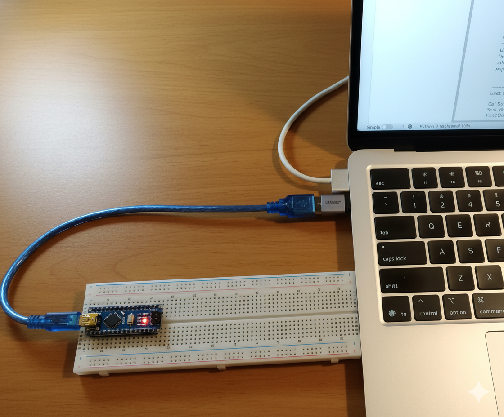

# Web-2-Home Concept (W2H)
Interact with your home server and IoT devices from anywhere by sending instructions from your website.

Tech stack: 
Python + Html + CSS + JS + PHP

 

This Arduino LED can be switched on and off from your website.

 

## How does it work?

Basic idea: Your computer uses a simple polling method to receive messages and instructions from you via your website. 

By default, your home network blocks anything on the internet from coming in. With w2h, every few seconds your computer sends an outgoing request to your website to see if you have sent any messages, commands or files. This allows your home server to receive instructions without compromising the security of your network. In other words, when you issue an instruction via your website, the instruction does not immediately go to your home server. It waits until your home server calls in and collects the instruction, which it then executes.

To ensure that only you can access your website, w2h uses a simple token based access control system.
 

## What is Long Polling?

Instead of asking "anything new?" every 2 seconds and always getting an instant answer, your computer asks once and the web server sits on the answer until it's actually true (or 20 seconds pass).

Think of status.json on the server as a mailbox, and the Mac as someone waiting for mail.

Old way (periodic polling):
The Mac walks to the mailbox, checks it, and walks away — every 2 seconds, forever. Most of the time the mailbox is empty, so it's a wasted trip. And if a letter arrives right after a check, the Mac doesn't find out for almost 2 more seconds (the next scheduled trip).

New way (long polling):
The Mac walks to the mailbox and says "I'll just wait here until something arrives." The server (the mailbox) doesn't send the Mac away empty-handed — it holds the door open and keeps peeking inside every 0.3 seconds on the Mac's behalf, and only replies the instant there's actually a letter (a new chat message, an uploaded file, or an LED command). If nothing shows up after about 20 seconds, the server finally says "still nothing, try again," and the Mac immediately starts waiting again.

Instead of asking "anything new?" every 2 seconds and always getting an instant answer, it asks once and the server sits on the answer until it's actually true (or 20 seconds pass).

You've traded request frequency for connection duration, and duration is the thing to watch if this ever needs to scale to more simultaneous clients than just the one Mac and one phone.

 

## What you can do with the example app

Use the web browser on your phone to send instructions to your laptop (home server).

- Send messages from a mobile chat interface and get dummy responses from the code running on your laptop.
- Use the control panel to press a button that remotely turns an Arduino LED on and off.
- Send files from your phone to your laptop.
- Check the latency of this approach.
- See the token access control system in action.

 
