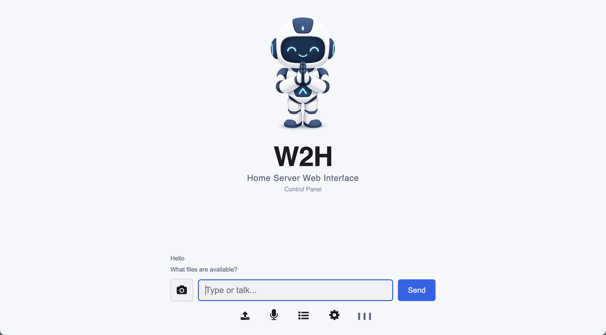
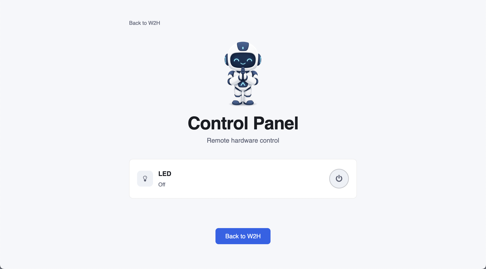

# Web 2 Home (W2H) - Home Server Web Interface

A web based polling system that lets you use a browser to interact with your home server and it's connected IoT devices from anywhere. No Tailscale, Amazon IoT or third party apps required.

Tech stack:<br>
Python + Html + CSS + JS + PHP

<br>


<p>Remotely chat with the agent running on your home server</p>

<br>


<p>Remotely control connected devices</p>

<br>


<p>This Arduino LED can be switched on and off from your website.<br>
Sensors, motors and other electronic devices can be controlled from your computer using the I/O (input/ouput) pins on the Arduino.</p>

<br>

## How does it work?

Basic idea:<br>
Your home server (just a normal computer) uses a polling method to receive messages and instructions from you via your website. Polling simply means that it makes a request to your website every few seconds i.e. it knocks on the door and asks: "Are there any messages for me."

By default, your home network blocks anything on the internet from coming in. With w2h, every few seconds your computer (home server) sends an outgoing request to your website (web server) to see if you've left any messages or files. This allows your home server to receive instructions without compromising the security of your network. In other words, when you issue an instruction via your website, the instruction does not immediately go to your home server. It waits until your home server calls in and collects the instruction.

Token based access control:<br>
To ensure that only you can access your website, w2h uses a simple token based access control system. You define the token in your code (```allowed_tokens.json``` and ```w2h-poller.py```). When you visit the website you are prompted to enter the token. If the token you entered matches the token defined in your code, the system gives you access. The token you entered is then stored in your web browser - this enables you to be logged in automatically the next time you visit.

<br>

## Periodic Polling vs Long Polling

The w2h system uses long polling.

Periodic polling:<br>
The home server goes to your website, checks for messages, and walks away — every 2 seconds, forever. Most of the time there are no messages, so it's a wasted trip. If a message arrives right after a check, your server doesn't find out for almost 2 more seconds (the next scheduled check).

Long polling:<br>
The home server goes to your website and says "I'll just wait here for 20 seconds or until something arrives." The website (web server) holds the door open and keeps checking for messages every 0.3 seconds. If a message arrives, the web server hands it over. If nothing shows up after 20 seconds, the web server finally says "Come back later." The home server leaves, comes back after two seconds, and waits again.

With long polling, request frequency is reduced and connection duration is increased. The net effect is to reduce the latency associated with periodic polling.

<br>

## Downsides of the w2h system

- Streaming is not possible.
- Latency associated with polling may be higher than the P2P connection that third party services provide.


<br>

## What you can do with the example app

Use the web browser on your phone to send instructions to your laptop (home server).

- Send messages from a mobile chat interface and get dummy responses from the code running on your laptop.
- Use the control panel to press a button that remotely turns an Arduino LED on and off.
- Send files from your phone to your laptop. The files will appear in: ```python-app/downloads```
- Get a feel for the latency associated with this approach.
- See the token access control system in action.

This code is a working example. It's a starting point that can be modified and expanded. You can use the polling system with any project. 

<br>

## How to run the example app
- You need to have the uv package manager installed.
- You need to know how to build and host a website
- Download the project folder
- Upload all files in the ```web-app``` folder to your web host
- Enter your website url into the ```w2h-poller.py``` file (located inside the ```python-app``` folder)
  ```
  YOUR_WEBSITE_URL = "https://my_website.com" 
  ARDUINO_PORT = "/dev/cu.usbserial-110" # (e.g. /dev/cu.usbserial-110 on mac and COM3 on Windows)
  ```
- Terminal: Cd into the ```python-app``` folder
- Terminal: uv run w2h-poller.py
- Go to the website url and enter this token to gain access: ```12345```

<br>

## How to connect the Arduino (Optional)

- Connect the Arduino to you computer.
- Set the port in ```w2h-poller.py```
  ```
  PORT = "/dev/cu.usbserial-110"   # Update to match your system (e.g. COM3 on Windows)
  ```
- There is a Arduino sketch in the folder named: ```arduino-sketch```. Upload this sketch to your Arduino.
- Go to the control panel page on the website. Press the button to turn the Arduino off and on.<br>
You will need to wait a few seconds while the command is sent and confirmed.<br>
If you initially see "Unknown - last command may have failed" - pressing the button should clear that message.

<br>

## A Working Local AI Agent Example

The W2H ProtoStar Agent Loop is a working example of how this system can be used with an AI agent. You can download the project from Hugging Face.<br>
https://huggingface.co/datasets/vbookshelf/W2H-ProtoStar-Agent-Loop

<br>

## References

- Connect Ai to the Physical World with Arduino<br>
  https://github.com/vbookshelf/Connect-Ai-to-the-Physical-World-with-Arduino
  
- Juru Lab Desktop Agent Sandbox<br>
  https://huggingface.co/datasets/vbookshelf/Juru-Lab-Agent-Sandbox-HYA
  
- Jai World - VRM 3D Embodied AI<br>
  https://huggingface.co/datasets/vbookshelf/Jai-World-VRM-3D-Embodied-AI

- W2H ProtoAgent Loop<br>
 https://huggingface.co/datasets/vbookshelf/W2H-ProtoAgent-Loop


<br>

## Revision History

Version 1.0<br>
10 Sept 2026<br>
First release.

<br>
